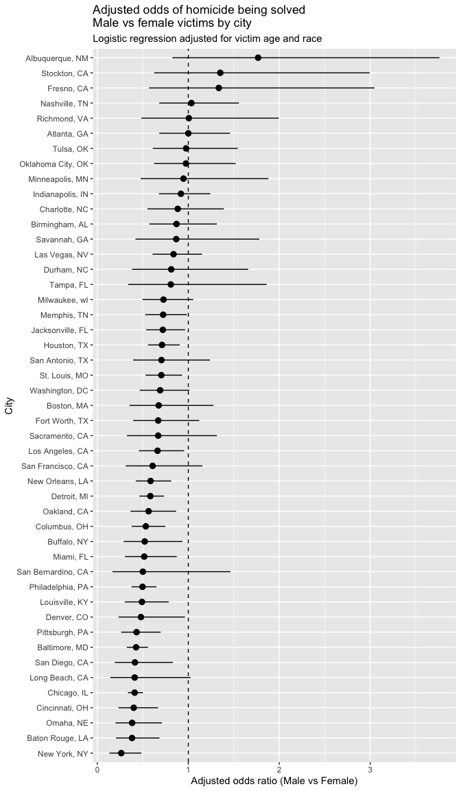
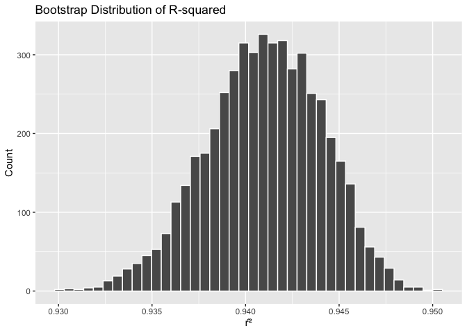
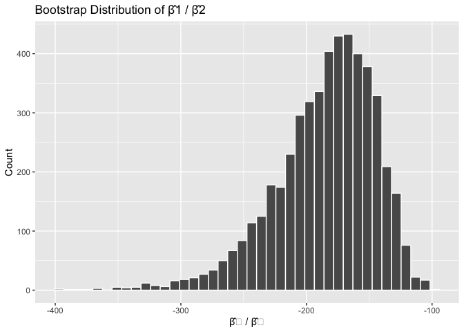
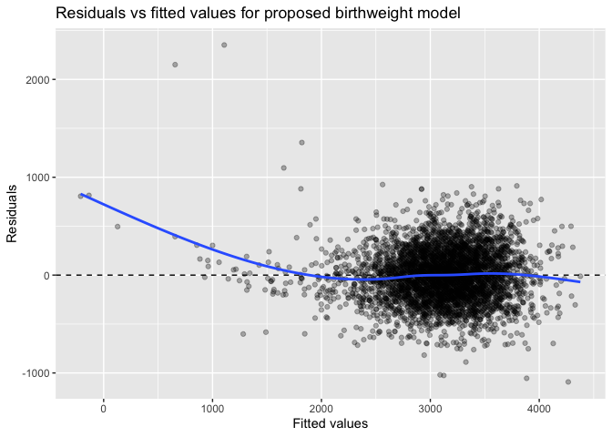

hw6
================
2025-11-30

## Problem 1

``` r
homicides =
  read_csv("homicide-data.csv") |>
  clean_names()

homicides = 
  homicides |>
  mutate(
    city_state = str_c(city, ", ", state),
    solved = disposition == "Closed by arrest",   # TRUE = solved, FALSE = not
    victim_age = as.numeric(victim_age)
  ) |>
  # drop specified cities with missing
  filter(
    !(city_state %in% c(
      "Dallas, TX",
      "Phoenix, AZ",
      "Kansas City, MO",
      "Tulsa, AL"
    ))
  ) |>
  # keep only white or black victims
  filter(victim_race %in% c("White", "Black")) |>
  # drop missing key variables
  filter(
    !is.na(victim_age),
    !is.na(victim_sex),
    !is.na(victim_race),
    !is.na(solved)
  )

glimpse(homicides)
```

    ## Rows: 39,403
    ## Columns: 14
    ## $ uid           <chr> "Alb-000003", "Alb-000005", "Alb-000006", "Alb-000009", …
    ## $ reported_date <dbl> 20100601, 20100102, 20100126, 20100130, 20100308, 201003…
    ## $ victim_last   <chr> "SATTERFIELD", "MULA", "BOOK", "MARTIN-LEYVA", "GRAY", "…
    ## $ victim_first  <chr> "VIVIANA", "VIVIAN", "GERALDINE", "GUSTAVO", "STEFANIA",…
    ## $ victim_race   <chr> "White", "White", "White", "White", "White", "White", "W…
    ## $ victim_age    <dbl> 15, 72, 91, 56, 43, 52, 22, 15, 25, 20, 88, 36, 47, 24, …
    ## $ victim_sex    <chr> "Female", "Female", "Female", "Male", "Female", "Male", …
    ## $ city          <chr> "Albuquerque", "Albuquerque", "Albuquerque", "Albuquerqu…
    ## $ state         <chr> "NM", "NM", "NM", "NM", "NM", "NM", "NM", "NM", "NM", "N…
    ## $ lat           <dbl> 35.08609, 35.13036, 35.15111, 35.07538, 35.07066, NA, 35…
    ## $ lon           <dbl> -106.6956, -106.5810, -106.5378, -106.5535, -106.6158, N…
    ## $ disposition   <chr> "Closed without arrest", "Closed without arrest", "Open/…
    ## $ city_state    <chr> "Albuquerque, NM", "Albuquerque, NM", "Albuquerque, NM",…
    ## $ solved        <lgl> FALSE, FALSE, FALSE, FALSE, TRUE, TRUE, TRUE, TRUE, TRUE…

### Logistic regression for Baltimore, MD

``` r
baltimore =
  homicides |>
  filter(city_state == "Baltimore, MD") |>
  mutate(
    victim_sex = fct_relevel(victim_sex, "Female"),  # Female as reference
    victim_race = fct_relevel(victim_race, "White")  # optional, for clarity
  )

baltimore_fit =
  glm(
    solved ~ victim_age + victim_sex + victim_race,
    data = baltimore,
    family = binomial()
  )

# tidy output, exponentiated to get odds ratios and CIs
baltimore_or =
  baltimore_fit |>
  tidy(exponentiate = TRUE, conf.int = TRUE)

baltimore_or
```

    ## # A tibble: 4 × 7
    ##   term             estimate std.error statistic  p.value conf.low conf.high
    ##   <chr>               <dbl>     <dbl>     <dbl>    <dbl>    <dbl>     <dbl>
    ## 1 (Intercept)         3.16    0.237        4.87 1.14e- 6    2.00      5.06 
    ## 2 victim_age          0.993   0.00332     -2.02 4.30e- 2    0.987     1.000
    ## 3 victim_sexMale      0.426   0.138       -6.18 6.26e-10    0.324     0.558
    ## 4 victim_raceBlack    0.431   0.175       -4.82 1.45e- 6    0.305     0.606

``` r
# male victims vs female victims, holding age and race fixed
baltimore_or_male =
  baltimore_or |>
  filter(term == "victim_sexMale") |>
  select(term, estimate, conf.low, conf.high)

baltimore_or_male
```

    ## # A tibble: 1 × 4
    ##   term           estimate conf.low conf.high
    ##   <chr>             <dbl>    <dbl>     <dbl>
    ## 1 victim_sexMale    0.426    0.324     0.558

### Logistic regression for each city

``` r
# fit glm within each city using a tidy purrr / list-column workflow
city_results =
  homicides |>
  mutate(
    victim_sex = fct_relevel(victim_sex, "Female"),
    victim_race = fct_relevel(victim_race, "White")
  ) |>
  group_by(city_state) |>
  nest() |>
  mutate(
    fit = map(
      data,
      ~ glm(
          solved ~ victim_age + victim_sex + victim_race,
          data = .x,
          family = binomial()
        )
    ),
    tidied = map(
      fit,
      ~ tidy(.x, exponentiate = TRUE, conf.int = TRUE)
    )
  ) |>
  unnest(tidied) |>
  # keep male vs female OR
  filter(term == "victim_sexMale") |>
  select(
    city_state,
    estimate,
    conf.low,
    conf.high
  ) |>
  ungroup()

city_results
```

    ## # A tibble: 47 × 4
    ##    city_state      estimate conf.low conf.high
    ##    <chr>              <dbl>    <dbl>     <dbl>
    ##  1 Albuquerque, NM    1.77     0.825     3.76 
    ##  2 Atlanta, GA        1.00     0.680     1.46 
    ##  3 Baltimore, MD      0.426    0.324     0.558
    ##  4 Baton Rouge, LA    0.381    0.204     0.684
    ##  5 Birmingham, AL     0.870    0.571     1.31 
    ##  6 Boston, MA         0.674    0.353     1.28 
    ##  7 Buffalo, NY        0.521    0.288     0.936
    ##  8 Charlotte, NC      0.884    0.551     1.39 
    ##  9 Chicago, IL        0.410    0.336     0.501
    ## 10 Cincinnati, OH     0.400    0.231     0.667
    ## # ℹ 37 more rows

``` r
city_results_plot_data =
  city_results |>
  mutate(
    city_state = fct_reorder(city_state, estimate)
  )

ggplot(city_results_plot_data, aes(x = city_state, y = estimate)) +
  geom_hline(yintercept = 1, linetype = "dashed") +
  geom_pointrange(
    aes(
      ymin = conf.low,
      ymax = conf.high
    )
  ) +
  coord_flip() +
  labs(
    x = "City",
    y = "Adjusted odds ratio (Male vs Female)",
    title = "Adjusted odds of homicide being solved\nMale vs female victims by city",
    subtitle = "Logistic regression adjusted for victim age and race"
  )
```

<!-- --> This plot shows
large city-to-city variation in the adjusted odds that a homicide is
solved for male versus female victims, controlling for age and race. The
dashed line marks no difference; most cities cluster near it, indicating
similar clearance rates by sex. However, some cities (e.g., Albuquerque,
Stockton, Fresno) show much higher odds for male victims, while a few
show higher odds for female victims. Overall, the figure highlights
substantial heterogeneity across jurisdictions.

# Problem 2

``` r
library(p8105.datasets)
data("weather_df")
weather_df = weather_df |> 
  drop_na(tmax, tmin, prcp)  # ensure complete cases

glimpse(weather_df)
```

    ## Rows: 2,171
    ## Columns: 6
    ## $ name <chr> "CentralPark_NY", "CentralPark_NY", "CentralPark_NY", "CentralPar…
    ## $ id   <chr> "USW00094728", "USW00094728", "USW00094728", "USW00094728", "USW0…
    ## $ date <date> 2021-01-01, 2021-01-02, 2021-01-03, 2021-01-04, 2021-01-05, 2021…
    ## $ prcp <dbl> 157, 13, 56, 5, 0, 0, 0, 0, 0, 0, 0, 0, 0, 0, 97, 198, 0, 0, 0, 5…
    ## $ tmax <dbl> 4.4, 10.6, 3.3, 6.1, 5.6, 5.0, 5.0, 2.8, 2.8, 5.0, 2.8, 6.7, 6.1,…
    ## $ tmin <dbl> 0.6, 2.2, 1.1, 1.7, 2.2, 1.1, -1.0, -2.7, -4.3, -1.6, -2.1, 0.6, …

``` r
set.seed(1130)

boot_results =
  tibble(id = 1:5000) |>
  mutate(
    boot_sample = map(
      id,
      ~ sample_n(weather_df, size = nrow(weather_df), replace = TRUE)
    ),
    boot_fit = map(
      boot_sample,
      ~ lm(tmax ~ tmin + prcp, data = .x)
    ),
    # Extract r^2
    r_sq = map_dbl(boot_fit, ~ glance(.x)$r.squared),
    # Extract beta1/beta2 ratio
    coef_df = map(boot_fit, ~ tidy(.x)),
    beta_ratio = map_dbl(
      coef_df,
      ~ {
        b1 = .x |> filter(term == "tmin") |> pull(estimate)
        b2 = .x |> filter(term == "prcp") |> pull(estimate)
        b1 / b2
      }
    )
  )
```

``` r
boot_results |> 
  ggplot(aes(x = r_sq)) +
  geom_histogram(bins = 40, color = "white") +
  labs(
    title = "Bootstrap Distribution of R-squared",
    x = "r̂²",
    y = "Count"
  )
```

<!-- -->

``` r
boot_results |> 
  ggplot(aes(x = beta_ratio)) +
  geom_histogram(bins = 40, color = "white") +
  labs(
    title = "Bootstrap Distribution of β̂1 / β̂2",
    x = "β̂₁ / β̂₂",
    y = "Count"
  )
```

<!-- -->

``` r
# CI for r^2
ci_r2 =
  quantile(boot_results$r_sq, probs = c(0.025, 0.975))

# CI for beta1/beta2 ratio
ci_ratio =
  quantile(boot_results$beta_ratio, probs = c(0.025, 0.975))

ci_r2
```

    ##      2.5%     97.5% 
    ## 0.9346296 0.9465444

``` r
ci_ratio
```

    ##      2.5%     97.5% 
    ## -279.5376 -125.0082

### **r̂²**

The bootstrap distribution of r̂² is very narrow and centered near
0.9346–0.9465, showing that model fit is extremely stable across
samples.  
The 95% CI (0.9346, 0.9465) reflects high precision in estimating the
explained variance.

### **β̂₁ / β̂₂**

The distribution of β̂₁/β̂₂ is extremely wide because the precipitation
coefficient is often close to zero, making the ratio unstable.  
This instability is reflected in the very large 95% CI (-279.5, -125).

# Problem 3

### Import and Clean

``` r
library(modelr)

birthweight_raw =
  read_csv("birthweight.csv") |>
  clean_names()

# basic cleaning
birthweight_df =
  birthweight_raw |>
  mutate(
    babysex = factor(babysex, levels = c(1, 2), labels = c("male", "female")),
    malform = factor(malform, levels = c(0, 1), labels = c("absent", "present")),
    mrace   = factor(mrace),
    frace   = factor(frace)
  )

# check missing data
birthweight_df |>
  summarise(across(everything(), ~ sum(is.na(.))))
```

    ## # A tibble: 1 × 20
    ##   babysex bhead blength   bwt delwt fincome frace gaweeks malform menarche
    ##     <int> <int>   <int> <int> <int>   <int> <int>   <int>   <int>    <int>
    ## 1       0     0       0     0     0       0     0       0       0        0
    ## # ℹ 10 more variables: mheight <int>, momage <int>, mrace <int>, parity <int>,
    ## #   pnumlbw <int>, pnumsga <int>, ppbmi <int>, ppwt <int>, smoken <int>,
    ## #   wtgain <int>

``` r
bw_for_reg =
  birthweight_df |>
  drop_na(
    bwt, bhead, blength, gaweeks,
    babysex, delwt, fincome, mrace,
    ppbmi, smoken, wtgain
  )

glimpse(bw_for_reg)
```

    ## Rows: 4,342
    ## Columns: 20
    ## $ babysex  <fct> female, male, female, male, female, male, female, female, mal…
    ## $ bhead    <dbl> 34, 34, 36, 34, 34, 33, 33, 33, 36, 33, 35, 35, 35, 36, 35, 3…
    ## $ blength  <dbl> 51, 48, 50, 52, 52, 52, 46, 49, 52, 50, 51, 51, 48, 53, 51, 4…
    ## $ bwt      <dbl> 3629, 3062, 3345, 3062, 3374, 3374, 2523, 2778, 3515, 3459, 3…
    ## $ delwt    <dbl> 177, 156, 148, 157, 156, 129, 126, 140, 146, 169, 130, 146, 1…
    ## $ fincome  <dbl> 35, 65, 85, 55, 5, 55, 96, 5, 85, 75, 55, 55, 75, 75, 65, 75,…
    ## $ frace    <fct> 1, 2, 1, 1, 1, 1, 2, 1, 1, 2, 1, 1, 1, 1, 1, 2, 1, 1, 1, 2, 1…
    ## $ gaweeks  <dbl> 39.9, 25.9, 39.9, 40.0, 41.6, 40.7, 40.3, 37.4, 40.3, 40.7, 4…
    ## $ malform  <fct> absent, absent, absent, absent, absent, absent, absent, absen…
    ## $ menarche <dbl> 13, 14, 12, 14, 13, 12, 14, 12, 11, 12, 13, 12, 13, 11, 12, 1…
    ## $ mheight  <dbl> 63, 65, 64, 64, 66, 66, 72, 62, 61, 64, 67, 62, 64, 68, 62, 6…
    ## $ momage   <dbl> 36, 25, 29, 18, 20, 23, 29, 19, 13, 19, 23, 16, 28, 23, 21, 1…
    ## $ mrace    <fct> 1, 2, 1, 1, 1, 1, 2, 1, 1, 2, 1, 1, 1, 1, 1, 2, 1, 1, 1, 2, 1…
    ## $ parity   <dbl> 3, 0, 0, 0, 0, 0, 0, 0, 0, 0, 0, 0, 0, 0, 0, 0, 0, 0, 0, 0, 0…
    ## $ pnumlbw  <dbl> 0, 0, 0, 0, 0, 0, 0, 0, 0, 0, 0, 0, 0, 0, 0, 0, 0, 0, 0, 0, 0…
    ## $ pnumsga  <dbl> 0, 0, 0, 0, 0, 0, 0, 0, 0, 0, 0, 0, 0, 0, 0, 0, 0, 0, 0, 0, 0…
    ## $ ppbmi    <dbl> 26.27184, 21.34485, 23.56517, 21.84508, 21.02642, 18.60030, 1…
    ## $ ppwt     <dbl> 148, 128, 137, 127, 130, 115, 105, 119, 105, 145, 110, 115, 1…
    ## $ smoken   <dbl> 0.000, 0.000, 1.000, 10.000, 1.000, 0.000, 0.000, 0.000, 0.00…
    ## $ wtgain   <dbl> 29, 28, 11, 30, 26, 14, 21, 21, 41, 24, 20, 31, 23, 21, 24, 2…

Model idea: birthweight is driven by gestational age and size at birth,
with additional contributions from maternal size (pre-pregnancy BMI,
delivery weight, weight gain), smoking, race, and income.

``` r
mod_mine =
  lm(
    bwt ~ gaweeks + blength + bhead +
      babysex + delwt + ppbmi + wtgain +
      smoken + mrace + fincome,
    data = bw_for_reg
  )

tidy(mod_mine)
```

    ## # A tibble: 13 × 5
    ##    term           estimate std.error statistic   p.value
    ##    <chr>             <dbl>     <dbl>     <dbl>     <dbl>
    ##  1 (Intercept)   -5674.      101.       -56.0  0        
    ##  2 gaweeks          11.3       1.46       7.75 1.10e- 14
    ##  3 blength          74.9       2.02      37.1  1.09e-261
    ##  4 bhead           131.        3.45      38.0  8.05e-273
    ##  5 babysexfemale    29.1       8.46       3.44 5.83e-  4
    ##  6 delwt             3.03      0.412      7.36 2.11e- 13
    ##  7 ppbmi            -9.18      2.58      -3.56 3.72e-  4
    ##  8 wtgain            1.10      0.568      1.93 5.36e-  2
    ##  9 smoken           -4.85      0.586     -8.28 1.67e- 16
    ## 10 mrace2         -139.        9.91     -14.0  8.57e- 44
    ## 11 mrace3          -76.6      42.3       -1.81 7.04e-  2
    ## 12 mrace4         -102.       19.3       -5.31 1.16e-  7
    ## 13 fincome           0.314     0.175      1.80 7.21e-  2

``` r
bw_aug =
  bw_for_reg |>
  add_predictions(mod_mine) |>
  add_residuals(mod_mine)

ggplot(bw_aug, aes(x = pred, y = resid)) +
  geom_point(alpha = 0.3) +
  geom_hline(yintercept = 0, linetype = "dashed") +
  geom_smooth(se = FALSE) +
  labs(
    x = "Fitted values",
    y = "Residuals",
    title = "Residuals vs fitted values for proposed birthweight model"
  )
```

<!-- --> \### Comparison

``` r
mod_main =
  lm(bwt ~ blength + gaweeks, data = bw_for_reg)

mod_int =
  lm(bwt ~ bhead * blength * babysex, data = bw_for_reg)
```

``` r
set.seed(2025)

cv_splits =
  crossv_mc(bw_for_reg, n = 100, test = 0.2)
```

``` r
rmse_for_model = function(formula, train_df, test_df) {
  fit = lm(formula, data = train_df)
  preds = predict(fit, newdata = test_df)
  sqrt(mean((test_df$bwt - preds)^2))
}

# build a long tibble of RMSEs across splits and models
cv_long =
  map_dfr(
    .x = seq_len(nrow(cv_splits)),
    .f = ~ {
      train_df = as_tibble(cv_splits$train[[.x]])
      test_df  = as_tibble(cv_splits$test[[.x]])

      tibble(
        split = .x,
        model = c("Length + GA",
                  "Head × Length × Sex (full int)",
                  "Proposed model"),
        rmse = c(
          rmse_for_model(bwt ~ blength + gaweeks,
                         train_df, test_df),
          rmse_for_model(bwt ~ bhead * blength * babysex,
                         train_df, test_df),
          rmse_for_model(
            bwt ~ gaweeks + blength + bhead +
              babysex + delwt + ppbmi + wtgain +
              smoken + mrace + fincome,
            train_df, test_df
          )
        )
      )
    }
  )
```

``` r
cv_long |>
  group_by(model) |>
  summarise(
    mean_rmse = mean(rmse),
    sd_rmse   = sd(rmse),
    .groups = "drop"
  )
```

    ## # A tibble: 3 × 3
    ##   model                          mean_rmse sd_rmse
    ##   <chr>                              <dbl>   <dbl>
    ## 1 Head × Length × Sex (full int)      289.   10.2 
    ## 2 Length + GA                         334.   14.9 
    ## 3 Proposed model                      273.    8.59

Across the 100 Monte Carlo splits, the proposed model has the lowest
mean RMSE (~273 g), indicating the best out-of-sample predictive
performance among the three models. The interaction model using head
circumference, length, and sex performs slightly worse (~289 g), and the
simple model with only length and gestational age has the highest
prediction error (~334 g), suggesting that omitting maternal and
additional neonatal covariates substantially reduces predictive
accuracy.
